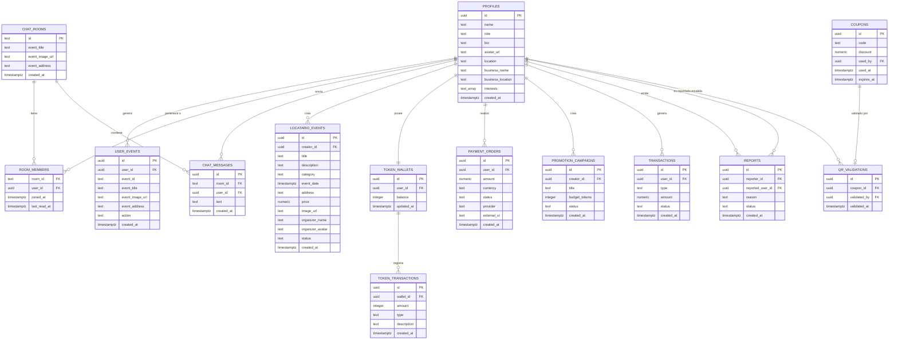

# Modelo Entidad-Relación (MER) — Proyecto eMeet

---

## 1. Consideraciones Previas

Este MER está construido a partir de dos fuentes: el tipo `Database` de TypeScript en `src/lib/supabase.ts` del frontend, y el análisis directo del repositorio `eMeet_Backend_SupaBase`. El esquema completo contiene **14 tablas** confirmadas.

Los datos de **lugares cercanos** provienen de **Google Places API** y no se almacenan de forma persistente en Supabase (se obtienen dinámicamente desde el backend, ruta `/places`).

---

## 2. Entidades y Atributos

### 2.1 `profiles` (Perfiles de usuario)

| Atributo | Tipo | Restricciones | Descripción |
|---|---|---|---|
| `id` | UUID | PK, FK → auth.users.id | Identificador único del usuario |
| `name` | TEXT | NOT NULL | Nombre del usuario |
| `role` | ENUM | NOT NULL, DEFAULT 'user' | `'user' \| 'locatario' \| 'admin'` |
| `bio` | TEXT | DEFAULT '' | Descripción personal |
| `avatar_url` | TEXT | NULL | URL de la foto de perfil |
| `location` | TEXT | DEFAULT '' | Ciudad o dirección del usuario |
| `business_name` | TEXT | NULL | Nombre del negocio (solo locatarios) |
| `business_location` | TEXT | NULL | Ubicación del negocio (solo locatarios) |
| `interests` | TEXT[] | DEFAULT '{}' | Categorías de interés del usuario |
| `created_at` | TIMESTAMPTZ | DEFAULT now() | Fecha de creación del perfil |

---

### 2.2 `user_events` (Acciones del usuario sobre eventos/lugares)

| Atributo | Tipo | Restricciones | Descripción |
|---|---|---|---|
| `id` | UUID | PK, DEFAULT gen_random_uuid() | Identificador único de la acción |
| `user_id` | UUID | FK → profiles.id | Usuario que realizó la acción |
| `event_id` | TEXT | NOT NULL | ID del evento o lugar (placeId) |
| `event_title` | TEXT | NULL | Título del evento o lugar |
| `event_image_url` | TEXT | NULL | URL de imagen |
| `event_address` | TEXT | NULL | Dirección del evento o lugar |
| `action` | ENUM | NOT NULL | `'like' \| 'save'` |
| `created_at` | TIMESTAMPTZ | DEFAULT now() | Fecha de la acción |

---

### 2.3 `chat_rooms` (Salas de chat comunitarias)

| Atributo | Tipo | Restricciones | Descripción |
|---|---|---|---|
| `id` | TEXT | PK | Igual al `placeId` del lugar asociado |
| `event_title` | TEXT | NOT NULL | Nombre del lugar/evento |
| `event_image_url` | TEXT | NULL | Imagen del lugar |
| `event_address` | TEXT | NULL | Dirección del lugar |
| `created_at` | TIMESTAMPTZ | DEFAULT now() | Fecha de creación de la sala |

---

### 2.4 `room_members` (Miembros de una sala de chat)

| Atributo | Tipo | Restricciones | Descripción |
|---|---|---|---|
| `room_id` | TEXT | PK (compuesto), FK → chat_rooms.id | Sala de chat |
| `user_id` | UUID | PK (compuesto), FK → profiles.id | Usuario miembro |
| `joined_at` | TIMESTAMPTZ | DEFAULT now() | Fecha de ingreso a la sala |
| `last_read_at` | TIMESTAMPTZ | DEFAULT now() | Última vez que el usuario leyó mensajes |

---

### 2.5 `chat_messages` (Mensajes de chat)

| Atributo | Tipo | Restricciones | Descripción |
|---|---|---|---|
| `id` | UUID | PK, DEFAULT gen_random_uuid() | Identificador único del mensaje |
| `room_id` | TEXT | NOT NULL, FK → chat_rooms.id | Sala a la que pertenece |
| `user_id` | UUID | DEFAULT auth.uid(), FK → profiles.id | Usuario remitente |
| `text` | TEXT | NOT NULL | Contenido del mensaje |
| `created_at` | TIMESTAMPTZ | DEFAULT now() | Fecha y hora del mensaje |

---

### 2.6 `locatario_events` (Eventos publicados por locatarios)

| Atributo | Tipo | Restricciones | Descripción |
|---|---|---|---|
| `id` | UUID | PK, DEFAULT gen_random_uuid() | Identificador único del evento |
| `creator_id` | UUID | DEFAULT auth.uid(), FK → profiles.id | Locatario creador del evento |
| `title` | TEXT | NOT NULL | Título del evento |
| `description` | TEXT | DEFAULT '' | Descripción detallada |
| `category` | ENUM | NOT NULL | Categoría del evento |
| `event_date` | TIMESTAMPTZ | NOT NULL | Fecha del evento |
| `address` | TEXT | DEFAULT '' | Dirección del evento |
| `price` | NUMERIC | NULL | Precio (null = gratis) |
| `image_url` | TEXT | NULL | URL de la imagen del evento |
| `organizer_name` | TEXT | DEFAULT '' | Nombre del organizador |
| `organizer_avatar` | TEXT | NULL | Avatar del organizador |
| `status` | TEXT | DEFAULT 'draft' | Estado del evento: `draft \| live`. Al crear desde el Modo Creador se publica directo en `live` |
| `created_at` | TIMESTAMPTZ | DEFAULT now() | Fecha de publicación |

---

### 2.7 `token_wallets` (Billetera de tokens del usuario)

| Atributo | Tipo | Restricciones | Descripción |
|---|---|---|---|
| `id` | UUID | PK | Identificador único |
| `user_id` | UUID | FK → profiles.id | Usuario propietario |
| `balance` | INTEGER | NOT NULL, DEFAULT 0 | Saldo de tokens disponibles |
| `updated_at` | TIMESTAMPTZ | DEFAULT now() | Última actualización |

---

### 2.8 `token_transactions` (Historial de movimientos de tokens)

| Atributo | Tipo | Restricciones | Descripción |
|---|---|---|---|
| `id` | UUID | PK | Identificador único |
| `wallet_id` | UUID | FK → token_wallets.id | Billetera afectada |
| `amount` | INTEGER | NOT NULL | Tokens (positivo = entrada, negativo = salida) |
| `type` | TEXT | NOT NULL | Tipo de operación |
| `description` | TEXT | NULL | Detalle de la transacción |
| `created_at` | TIMESTAMPTZ | DEFAULT now() | Fecha |

---

### 2.9 `payment_orders` (Órdenes de pago)

| Atributo | Tipo | Restricciones | Descripción |
|---|---|---|---|
| `id` | UUID | PK | Identificador único |
| `user_id` | UUID | FK → profiles.id | Usuario que realiza el pago |
| `amount` | NUMERIC | NOT NULL | Monto en CLP |
| `currency` | TEXT | DEFAULT 'CLP' | Moneda |
| `status` | TEXT | NOT NULL | `pending \| paid \| failed \| refunded` |
| `provider` | TEXT | NOT NULL | `mercadopago \| transbank` |
| `external_id` | TEXT | NULL | ID de la transacción en el proveedor |
| `created_at` | TIMESTAMPTZ | DEFAULT now() | Fecha de creación |

---

### 2.10 `promotion_campaigns` (Campañas de promoción de locatarios)

| Atributo | Tipo | Restricciones | Descripción |
|---|---|---|---|
| `id` | UUID | PK | Identificador único |
| `creator_id` | UUID | FK → profiles.id | Locatario dueño de la campaña |
| `title` | TEXT | NOT NULL | Nombre de la campaña |
| `budget_tokens` | INTEGER | NOT NULL | Presupuesto en tokens |
| `status` | TEXT | NOT NULL | `active \| paused \| finished` |
| `created_at` | TIMESTAMPTZ | DEFAULT now() | Fecha de creación |

---

### 2.11 `coupons` (Cupones de descuento)

| Atributo | Tipo | Restricciones | Descripción |
|---|---|---|---|
| `id` | UUID | PK | Identificador único |
| `code` | TEXT | UNIQUE NOT NULL | Código alfanumérico del cupón |
| `discount` | NUMERIC | NOT NULL | Descuento aplicado (%) |
| `used_by` | UUID | NULL, FK → profiles.id | Usuario que lo usó |
| `used_at` | TIMESTAMPTZ | NULL | Fecha de uso |
| `expires_at` | TIMESTAMPTZ | NOT NULL | Fecha de expiración |

---

### 2.12 `transactions` (Registro contable general)

| Atributo | Tipo | Restricciones | Descripción |
|---|---|---|---|
| `id` | UUID | PK | Identificador único |
| `user_id` | UUID | FK → profiles.id | Usuario involucrado |
| `type` | TEXT | NOT NULL | Tipo de operación |
| `amount` | NUMERIC | NOT NULL | Monto |
| `status` | TEXT | NOT NULL | Estado |
| `created_at` | TIMESTAMPTZ | DEFAULT now() | Fecha |

---

### 2.13 `reports` (Reportes de contenido)

| Atributo | Tipo | Restricciones | Descripción |
|---|---|---|---|
| `id` | UUID | PK | Identificador único |
| `reporter_id` | UUID | FK → profiles.id | Usuario que reporta |
| `reported_user_id` | UUID | NULL, FK → profiles.id | Usuario reportado |
| `reason` | TEXT | NOT NULL | Motivo del reporte |
| `status` | TEXT | DEFAULT 'pending' | `pending \| resolved \| dismissed` |
| `created_at` | TIMESTAMPTZ | DEFAULT now() | Fecha |

---

### 2.14 `qr_validations` (Validaciones de cupones vía QR)

| Atributo | Tipo | Restricciones | Descripción |
|---|---|---|---|
| `id` | UUID | PK | Identificador único |
| `coupon_id` | UUID | FK → coupons.id | Cupón validado |
| `validated_by` | UUID | FK → profiles.id | Usuario que validó |
| `validated_at` | TIMESTAMPTZ | DEFAULT now() | Fecha de validación |

---

## 3. Relaciones

| Relación | Tipo | Descripción |
|---|---|---|
| `profiles` ← `user_events` | 1:N | Un usuario puede tener muchas acciones sobre eventos |
| `profiles` ← `room_members` | 1:N | Un usuario puede ser miembro de muchas salas |
| `profiles` ← `chat_messages` | 1:N | Un usuario puede enviar muchos mensajes |
| `profiles` ← `locatario_events` | 1:N | Un locatario puede crear muchos eventos |
| `chat_rooms` ← `room_members` | 1:N | Una sala puede tener muchos miembros |
| `chat_rooms` ← `chat_messages` | 1:N | Una sala puede contener muchos mensajes |
| `profiles` ← `token_wallets` | 1:1 | Cada usuario tiene una billetera de tokens |
| `token_wallets` ← `token_transactions` | 1:N | Una billetera tiene muchos movimientos |
| `profiles` ← `payment_orders` | 1:N | Un usuario puede tener muchas órdenes de pago |
| `profiles` ← `promotion_campaigns` | 1:N | Un locatario puede crear muchas campañas |
| `profiles` ← `coupons` (used_by) | 1:N | Un usuario puede usar varios cupones |
| `coupons` ← `qr_validations` | 1:1 | Un cupón tiene máximo una validación QR |
| `profiles` ← `qr_validations` (validated_by) | 1:N | Un usuario puede validar varios cupones |
| `profiles` ← `reports` (reporter) | 1:N | Un usuario puede emitir varios reportes |
| `profiles` ← `reports` (reported) | 1:N | Un usuario puede ser reportado varias veces |
| `profiles` ← `transactions` | 1:N | Un usuario tiene muchos registros contables |

---

## 4. Diagrama MER (Mermaid)

---

## 5. Supuestos y Consideraciones

| Supuesto | Justificación |
|---|---|
| El campo `profiles.id` es igual a `auth.users.id` de Supabase | Confirmado por el tipo `Insert.id` en `supabase.ts` |
| La tabla `user_events` almacena tanto likes como guardados | Confirmado por el campo `action: 'like' \| 'save'` |
| Las salas de chat (`chat_rooms.id`) usan el `placeId` de Google Places | Confirmado por `ChatContext` y el tipo `ChatRoom` en `types/index.ts` |
| Los campos `lat` y `lng` en `locatario_events` pueden existir en el schema sin estar en el tipo TypeScript | Inferido desde `LocatarioEventsContext.tsx` |
| Las 8 tablas de monetización existen en el backend (`token_wallets`, `token_transactions`, `payment_orders`, `promotion_campaigns`, `coupons`, `transactions`, `reports`, `qr_validations`) | Confirmado por las rutas `/monetization` y `/admin` del backend Express |

---

## 6. Relación con Supabase

- Todas las tablas documentadas residen en el proyecto Supabase: `https://supabase.com/dashboard/project/ksghpwonmnxmbhmfpaog`
- Supabase Auth gestiona la tabla `auth.users`, sobre la cual se construye `profiles` mediante FK.
- Supabase Realtime monitorea INSERT en `chat_messages` para actualizar el chat en tiempo real.
- Supabase Storage almacena avatares e imágenes de eventos (referenciados desde `avatar_url`, `image_url`, `event_image_url`).
- Las políticas RLS (Row Level Security) deben estar configuradas para garantizar que cada usuario solo acceda a sus propios datos. Su configuración exacta es **pendiente por validar**.

---

## 7. Estado de Validación

| Elemento | Estado | Detalle |
|---|---|---|
| Tablas core (profiles, user_events, chat_rooms, room_members, chat_messages, locatario_events) | ✅ Confirmado | Tipo `Database` en `src/lib/supabase.ts` del frontend |
| Tablas de monetización (8 tablas) | ✅ Confirmado | Rutas `/monetization`, `/admin` del backend Express |
| Esquema SQL con scripts | ✅ Confirmado | Ver [Datos-y-script.md](../Producto/Datos-y-script.md) |
| Tabla `cached_places` (propuesta anterior) | ❌ No implementada | Los lugares de Google Places se consultan en tiempo real, sin caché persistente |
| Políticas RLS en Supabase | ⚠️ Sin acceso directo | Backend usa `SUPABASE_SERVICE_ROLE_KEY` para bypassear RLS en operaciones admin |
