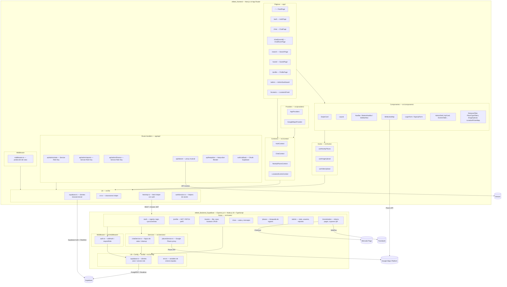
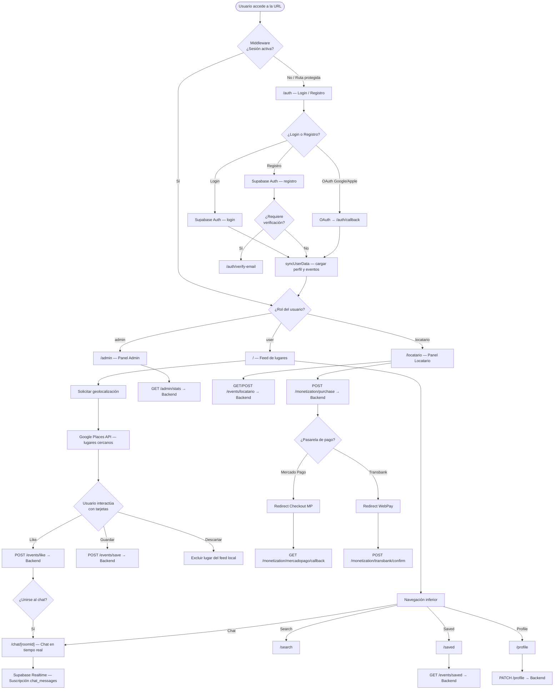
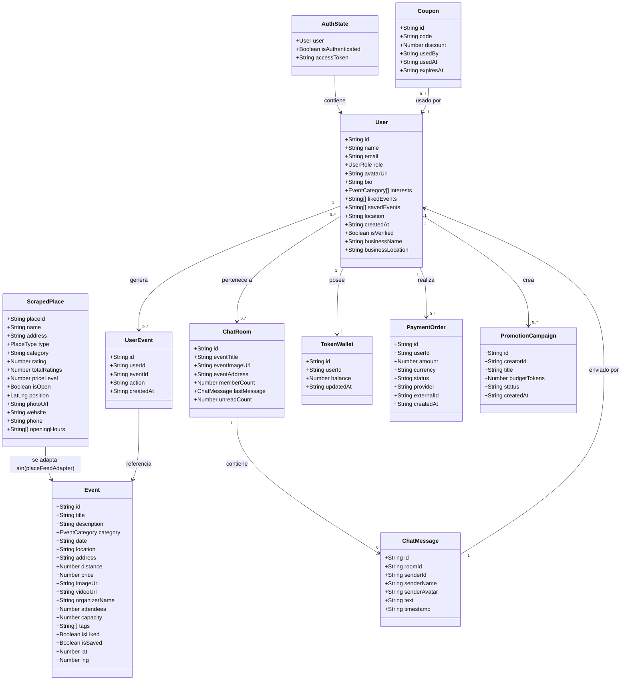

# Diagramas UML — Proyecto eMeet

> Todos los diagramas están representados en formato **Mermaid** y se basan en el análisis real de ambos repositorios: `eMeet_frontend` y `eMeet_Backend_SupaBase`.

---

## 1. Diagrama de Casos de Uso

```mermaid
flowchart TD
    U([Usuario Regular])
    L([Locatario])
    A([Administrador])
    SYS[[Sistema eMeet]]

    U -->|Registrarse / Iniciar sesión| SYS
    U -->|Explorar feed de lugares| SYS
    U -->|Dar like a un lugar| SYS
    U -->|Guardar un lugar| SYS
    U -->|Ver lugares guardados| SYS
    U -->|Buscar y filtrar lugares| SYS
    U -->|Unirse a sala de chat| SYS
    U -->|Enviar mensajes en chat| SYS
    U -->|Ver mensajes en tiempo real| SYS
    U -->|Editar perfil e intereses| SYS
    U -->|Cerrar sesión| SYS

    L -->|Registrarse como locatario| SYS
    L -->|Crear evento propio| SYS
    L -->|Eliminar evento propio| SYS
    L -->|Ver mis eventos publicados| SYS
    L -->|Comprar tokens| SYS
    L -->|Crear campaña de promoción| SYS
    L -->|Generar cupón con QR| SYS
    L -->|Pagar con Mercado Pago / Transbank| SYS

    A -->|Ver dashboard y KPIs| SYS
    A -->|Gestionar usuarios| SYS
    A -->|Gestionar eventos publicados| SYS
    A -->|Moderar contenido y reportes| SYS
    A -->|Resolver reportes de usuarios| SYS
    A -->|Ver estadísticas financieras| SYS
    A -->|Gestionar transacciones| SYS

    SYS -->|Supabase Auth| SA[(Supabase Auth)]
    SYS -->|Google Places API| GP[(Google Places)]
    SYS -->|Supabase Realtime| RT[(Supabase Realtime)]
    SYS -->|eMeet_Backend_SupaBase| BE[(Backend API REST)]
    SYS -->|Mercado Pago| MP[(Mercado Pago)]
    SYS -->|Transbank WebPay| TB[(Transbank)]
    SYS -->|Deezer API| DZ[(Deezer)]
```

---

## 2. Diagrama de Componentes

---

## 3. Diagrama de Flujo General de la Aplicación

---

## 4. Diagrama de Clases Conceptual

---

## 5. Notas sobre los Diagramas

- Los diagramas representan el estado actual de ambos repositorios (`eMeet_frontend` y `eMeet_Backend_SupaBase`) según el análisis directo del código.
- El backend `eMeet_Backend_SupaBase` está completamente analizado: Express.js 4.21 + Node.js 20 + TypeScript 5.6 + Prisma 6.19, con 7 grupos de rutas confirmados en `src/app.ts`.
- Las 14 tablas de Supabase fueron confirmadas desde el tipo `Database` en `src/lib/supabase.ts` del frontend y las rutas del backend.
- La clase `ScrapedPlace` representa los datos obtenidos desde Google Places API y se transforma en objetos `Event` mediante el adaptador `src/data/placeFeedAdapter.ts`.
- Los servicios externos de pago (Mercado Pago, Transbank) y música (Deezer) son proxiados exclusivamente por el backend Express — no se llaman directamente desde el frontend.
